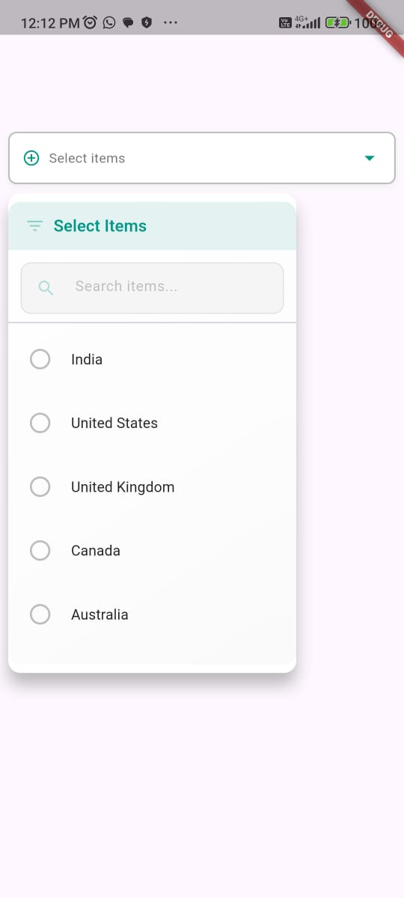

# Multi Select Dropdown

A customizable Flutter multi-select dropdown widget with search support and optional server-side search.  
Perfect for large datasets, tagging, categories, cities, countries, and more.

## ✨ Features

- ✅ Multi select dropdown
- 🔍 Built-in search field
- 🌐 Server-side search support (async)
- ⚡ Loading indicator while searching
- 🎨 Customizable UI (colors, styles)
- 📱 Works on Android, iOS, Web

---

## 🚀 Getting Started

Add the dependency to your `pubspec.yaml`:

```yaml
dependencies:
  f_multi_select_dropdown: ^0.1.1
````

## 📸 Screenshots





